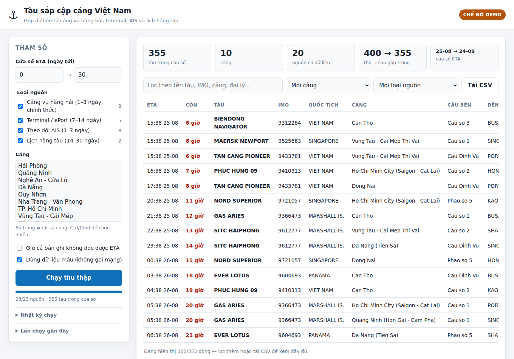

# vnports — tàu biển sắp cập cảng Việt Nam (ETA 0–30 ngày)

Công cụ dòng lệnh thu thập danh sách **tàu dự kiến cập cảng Việt Nam** trong khoảng
1–30 ngày tới, gộp từ nhiều nguồn: cảng vụ hàng hải, ePort của terminal, các trang
theo dõi AIS và lịch tàu của hãng tàu.

👉 Danh mục **tất cả các nguồn có thể có** (kèm tầm nhìn ETA, chi phí, điều khoản sử
dụng): [`docs/SOURCES.md`](docs/SOURCES.md).

## Cài đặt

```bash
pip install -r requirements.txt      # requests, beautifulsoup4, lxml
```

## Dùng nhanh

```bash
# Toàn bộ cảng, mọi nguồn, ETA trong 30 ngày tới, ghi ra CSV
python -m vnports fetch --days 30 --out data/arrivals.csv

# Chỉ tàu đến sau 24h, khu vực Hải Phòng + Vũng Tàu
python -m vnports fetch --ports haiphong,vungtau --from-days 1 --days 30

# Chỉ nguồn chính thức (cảng vụ) cho 3 ngày tới — chính xác nhất
python -m vnports fetch --kinds port_authority --days 3

# Khung 2–4 tuần: chỉ lịch hãng tàu và terminal mới phủ được
python -m vnports fetch --kinds carrier,terminal --days 30 --format json --out data/plan.json
```

Các lệnh khác:

```bash
python -m vnports list-ports            # danh mục cảng và ID tương ứng từng nguồn
python -m vnports list-sources          # 23 nguồn đã cấu hình, nguồn nào cần API key
python -m vnports doctor --dump-dir raw/  # kiểm tra nguồn nào truy cập & parse được
```

## Web app

Giao diện web để bấm chạy job và xem kết quả ngay trên trình duyệt:

```bash
pip install -r requirements-web.txt
python -m webapp.server                 # mở http://127.0.0.1:8000
python -m webapp.server --demo          # dữ liệu mẫu, không gọi mạng
```



Giao diện gồm: chọn cửa sổ ETA, loại nguồn và cảng ở panel trái; bấm **Chạy thu thập**
để tạo job chạy nền; thanh tiến độ + nhật ký cập nhật theo thời gian thực; bảng kết
quả có tìm kiếm, lọc theo cảng/loại nguồn, sắp xếp theo cột và nút tải CSV.

Cột **Nguồn** hiển thị nguồn chính; huy hiệu `+n` bên cạnh cho biết bản ghi được gộp
từ thêm n nguồn khác (di chuột để xem tên).

### API

| Method | Đường dẫn | Công dụng |
|---|---|---|
| `GET` | `/api/config` | Danh mục cảng + nguồn (để dựng form) |
| `POST` | `/api/jobs` | Tạo job; body: `ports`, `kinds`, `sources`, `days`, `from_days`, `demo` |
| `GET` | `/api/jobs` | Danh sách job gần đây |
| `GET` | `/api/jobs/{id}` | Trạng thái, tiến độ, nhật ký, lỗi |
| `GET` | `/api/jobs/{id}/results` | Kết quả dạng JSON |
| `GET` | `/api/jobs/{id}/results.csv` | Tải CSV (có BOM cho Excel) |
| `POST` | `/api/jobs/{id}/cancel` | Hủy job đang chạy |

Tài liệu tương tác có sẵn tại `/docs` (Swagger UI của FastAPI).

**Lưu ý triển khai:** job và kết quả nằm trong bộ nhớ tiến trình (giữ 20 job gần
nhất), phù hợp chạy nội bộ một tiến trình. Muốn nhiều worker hoặc giữ lịch sử lâu dài
thì thay `JobStore` bằng Redis/DB và chạy job bằng RQ/Celery. Server chưa có xác thực
— đừng mở thẳng ra Internet.

## Chế độ demo

Không có mạng tới các trang cảng vụ vẫn thử được toàn bộ luồng: `--demo` (hoặc tick
*Dùng dữ liệu mẫu*) sinh bảng HTML giống trang thật với ETA tính theo giờ hiện tại,
đi qua đúng bộ parser và bộ gộp trùng như dữ liệu thật.

## Tầm nhìn ETA: vì sao cần nhiều nguồn

Không nguồn miễn phí nào phủ trọn 30 ngày:

| Nhóm nguồn | Tầm nhìn thực tế | Độ chính xác |
|---|---|---|
| Cảng vụ hàng hải (kế hoạch điều động) | 1–3 ngày | Cao nhất, chính thức |
| Terminal / ePort | 7–14 ngày | Cao cho tàu container |
| AIS (VesselFinder, MarineTraffic…) | 1–7 ngày | Theo khai báo của tàu |
| Lịch hãng tàu (CMA CGM, Maersk, ONE…) | 14–45 ngày | Kế hoạch, hay đổi |

`vnports` gộp trùng theo IMO → MMSI → tên tàu (chuẩn hoá) và ưu tiên
`cảng vụ > terminal > AIS > hãng tàu`; bản ghi ưu tiên thấp hơn chỉ bổ sung các
trường còn thiếu, đồng thời ETA lệch nhau được ghi lại trong `_eta_variants`.

## API key (tuỳ chọn)

```bash
export MARINETRAFFIC_API_KEY=...   # services.marinetraffic.com
export VESSELFINDER_API_KEY=...    # api.vesselfinder.com/docs/expectedarrivals.html
```

Không có key thì nguồn tương ứng tự động bị bỏ qua, phần còn lại vẫn chạy.

## Cấu trúc

```
vnports/
  cli.py           lệnh fetch / doctor / list-sources / list-ports
  jobs.py          job chạy nền + tiến độ, dùng chung cho web app
  demo.py          sinh dữ liệu mẫu cho chế độ demo
  sources/
    catalog.py     khai báo 23 nguồn (cảng vụ, terminal, AIS, hãng tàu)
    base.py        engine đọc bảng HTML dùng chung
    apis.py        engine gọi API JSON có key
  tables.py        nhận diện cột theo từ khoá Việt/Anh (không gắn chết CSS selector)
  dates.py         đọc mọi định dạng ngày giờ, quy về Asia/Ho_Chi_Minh
  aggregate.py     lọc cửa sổ ETA + gộp trùng giữa các nguồn
  data_ports.json  danh mục cảng, sửa trực tiếp để thêm cảng/ID
webapp/
  server.py        FastAPI: /api/jobs, /api/config, tải CSV
  static/          giao diện vanilla JS, không cần build step
docs/SOURCES.md    toàn bộ nguồn khả dụng
tests/             23 test chạy offline (parser, gộp trùng, job, API)
```

## Thêm nguồn mới

Đa số nguồn chỉ là một dòng khai báo trong `vnports/sources/catalog.py`:

```python
HtmlTableSource(
    name="cvhh_thanhhoa", kind="port_authority",
    url_template="https://cangvuhanghaithanhhoa.gov.vn/ke-hoach-tau?d={d}",
    day_offsets=[0, 1, 2], horizon_days=2,
    global_source=True, port_key="thanhhoa",
)
```

Bộ trích xuất bảng tự dò `<table>`, đọc hàng tiêu đề và ánh xạ cột theo từ khoá
(“Tên tàu”, “Thời gian đến”, “Vessel”, “ETA”…), nên thường không cần viết parser riêng.
Tiêu đề lạ thì bổ sung từ khoá vào `COLUMN_KEYWORDS` trong `vnports/tables.py`.

## Kiểm thử

```bash
python -m unittest discover -s tests -v
```

Test chạy hoàn toàn offline trên HTML mẫu trong `tests/fixtures/` và dữ liệu demo.
Phần test API cần `pip install httpx`, thiếu thì tự bỏ qua.

## Trạng thái

Mã được viết trong môi trường **bị chặn toàn bộ truy cập mạng ra ngoài**, nên các URL
và cấu trúc bảng lấy từ tài liệu/kết quả tìm kiếm công khai và **chưa đối chiếu được
với trang thật**. Chạy `python -m vnports doctor --dump-dir raw/` trên máy có mạng để
biết nguồn nào hoạt động và chỉnh lại URL/từ khoá cột nếu cần.

Riêng phần web app đã được kiểm tra đầy đủ bằng trình duyệt thật (Playwright/Chromium)
ở chế độ demo: tạo job, theo dõi tiến độ, gộp trùng, lọc, sắp xếp, tải CSV, giao diện
hẹp và trường hợp mọi nguồn đều lỗi.
